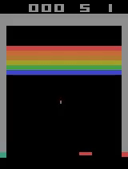

# Deep Reinforcement Learning for Atari Breakout Game
Replicating Deep RL papers by DeepMind for the Atari Breakout game.

# Models
Deep Q-Network

Double Deep Q-Network

Dueling Deep Q-Network

Asynchronous Advantage Actor Critic 

# Papers

Playing Atari with Deep Reinforcement Learning:

https://www.cs.toronto.edu/~vmnih/docs/dqn.pdf

Human-level control through deep reinforcement learning:

https://web.stanford.edu/class/psych209/Readings/MnihEtAlHassibis15NatureControlDeepRL.pd

Dueling Network Architectures for Deep Reinforcement Learning:

https://arxiv.org/abs/1511.06581

Asynchronous Methods for Deep Reinforcement Learning:

https://arxiv.org/abs/1602.01783

# Other References

## Helpful Introductory Blogposts
https://becominghuman.ai/lets-build-an-atari-ai-part-1-dqn-df57e8ff3b26

https://towardsdatascience.com/tutorial-double-deep-q-learning-with-dueling-network-architectures-4c1b3fb7f756

## Discounted Reward Calculation for A3C
https://danieltakeshi.github.io/2018/06/28/a2c-a3c/

